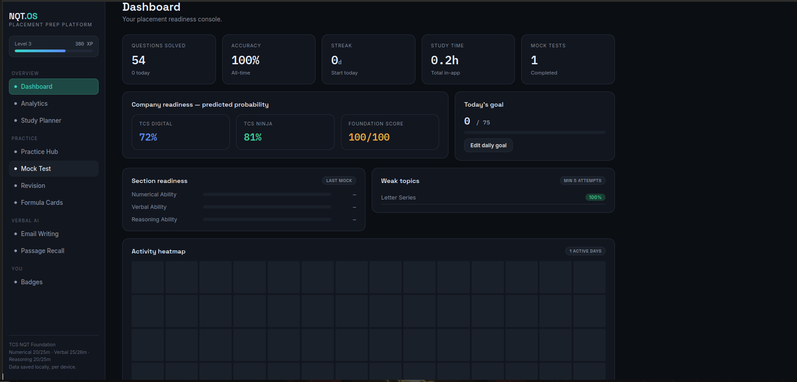
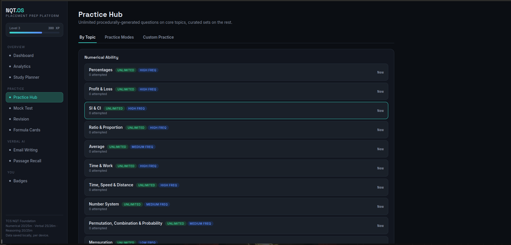
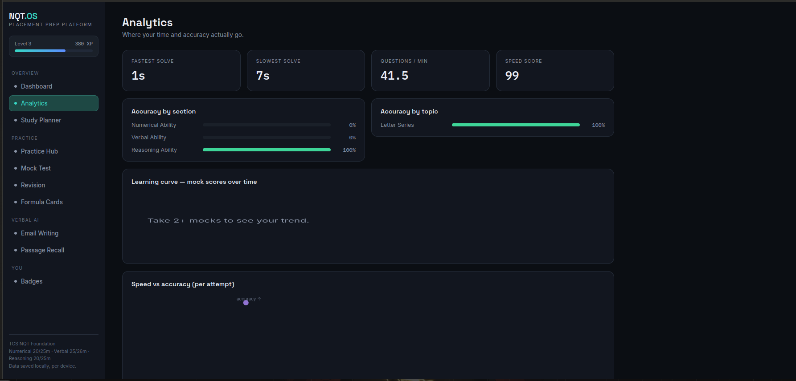
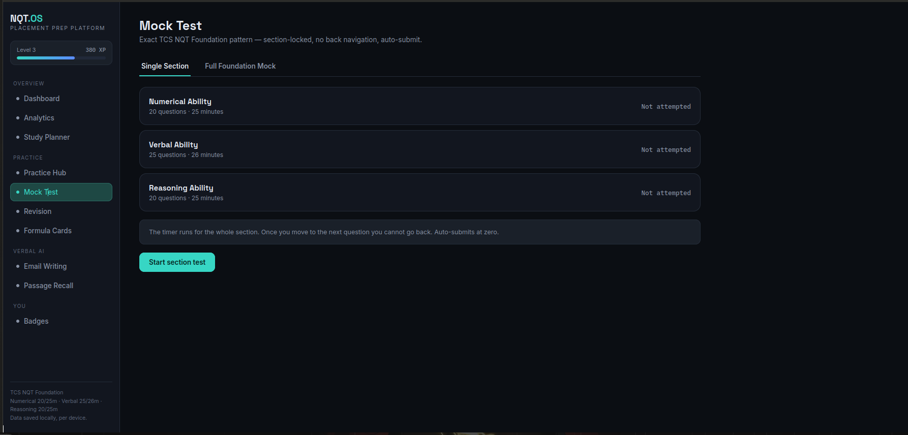

# 🚀 TCS NQT Aptitude Preparation Dashboard

> A modern aptitude preparation dashboard inspired by the latest **TCS NQT** exam pattern, designed to help students practice Numerical Ability, Reasoning Ability, and Verbal Ability through structured learning, timed practice, and detailed performance analytics.

  
  
  

---

## 📌 Overview

This project is built to provide a single platform for aptitude preparation instead of switching between multiple websites.

It focuses on the latest TCS NQT pattern while remaining useful for other service-based company placement exams.

### Key Features

- 📚 Topic-wise & Subtopic-wise Practice
- ⏱️ Question-wise and Topic-wise Timers
- 📊 Performance Analytics
- 📈 Progress Tracking
- 🎯 Daily Study Planner
- 📝 Mock Tests
- 📌 Bookmark & Revision
- 📉 Weak Topic Analysis
- 💡 Detailed Solutions & Shortcuts

---

## 🖥 Dashboard Preview

### 🏠 Home Dashboard

  

---

### 📚 Practice Hub

  

---

### 📊 Analytics

  

---

### 📝 Mock Test

  

# 🚀 Planned Improvements

- Adaptive Practice Mode
- AI-based Performance Insights
- Cloud Progress Sync
- Authentication
- Leaderboard
- Mobile Responsive Optimization

---

# 👨‍💻 Author

**Ankit Raj**

🎓 B.Tech in Data Science

- GitHub: https://github.com/Ankit04raj
- LinkedIn: https://www.linkedin.com/in/ankit04raj/

---

⭐ If you like this project, consider giving it a **Star** on GitHub.
